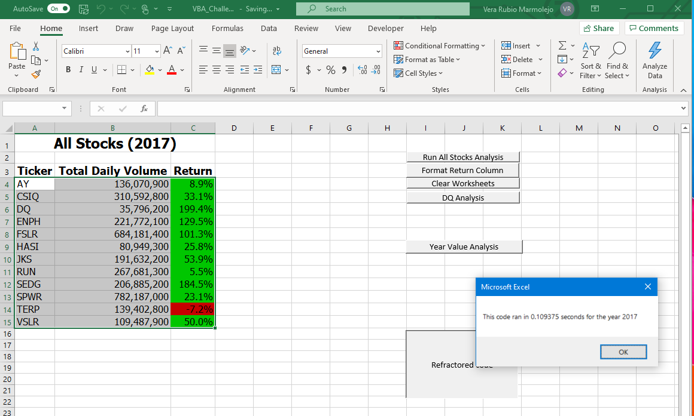
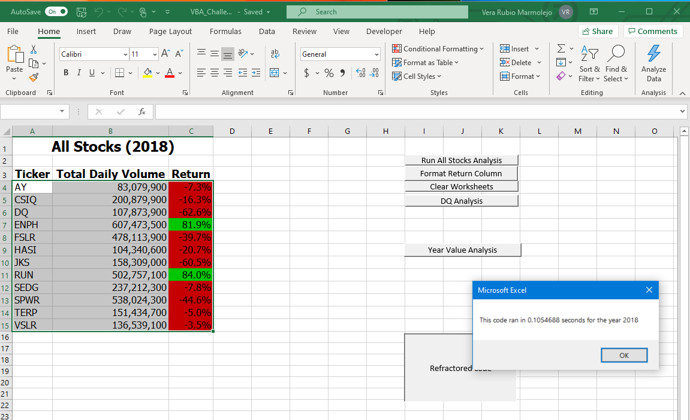
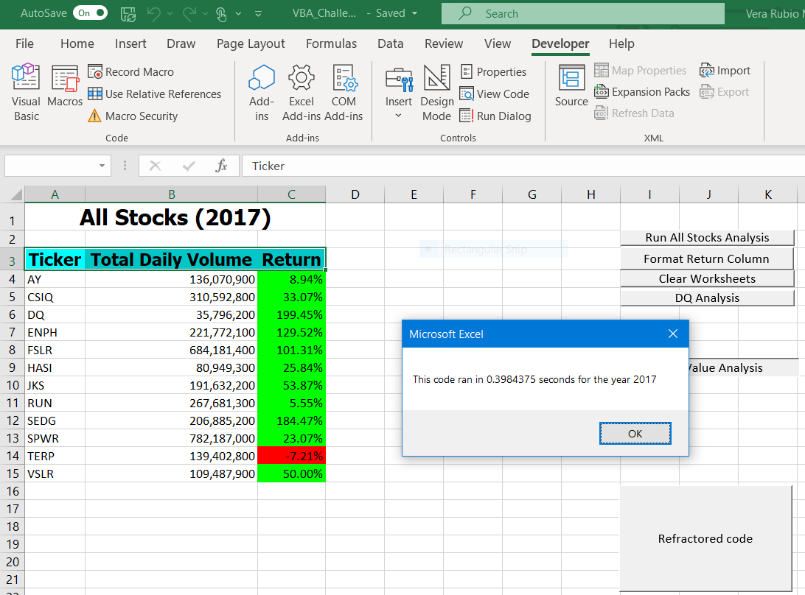
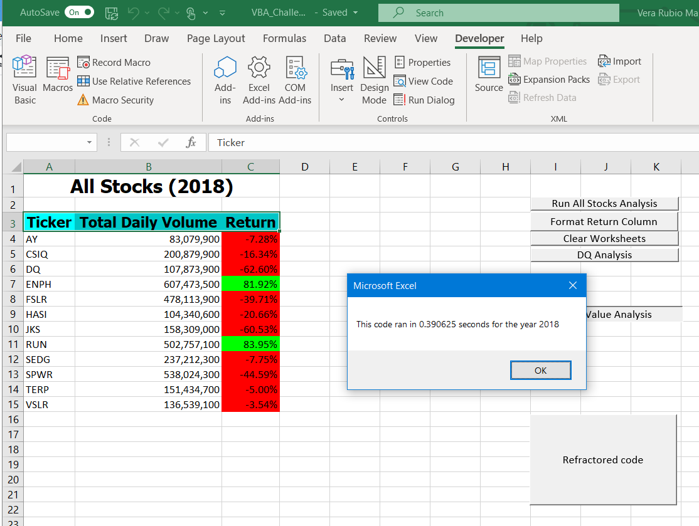
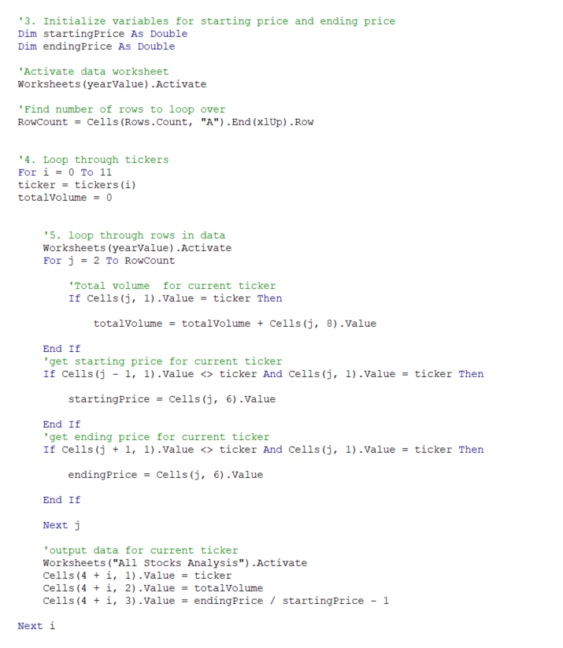
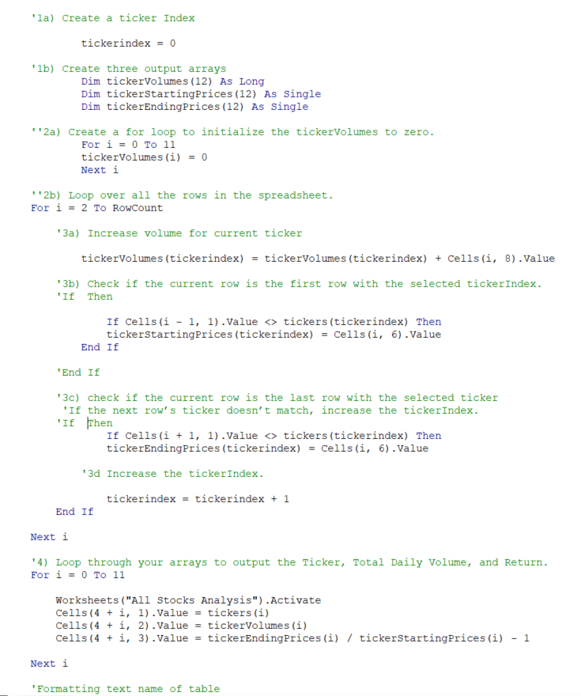

# ***Stock Analysis Challenge***

## **Project Overview**

### *Background* 

Steve just graduated from college, and his parents became Steve's first clients. Steve's parents are interested in investing on the stock market and believe that investing in green energy or alternative energy is the way to go. Steve asked us for help to analyze different companies in order to diversify his parents investment.

### *Purpose*

The purpose of this analysis is to help Steve visualize the data of the different companies through different years in a simple and efficient way.

## **Results**

### *Overview of Analysis*

According to the analysis for the year **2017**, 11 out of 12 companies were profitable. The tickers that were the most profitable were DQ with a 199.4% Return; SEDG with 184.5%; ENPH with 129.5%. 

### **All Stocks 2017**

However for the analysis for the year **2018**, only 2 out of 12 companies were profitable. The tickers that were profitable were ENPH with 81.9%; and RUN with 84%. 

### **All Stocks 2018**

Noticing the trend in the two year period, the alternative energy company that Steve should recommend his parents to invest is ENPH. 
    
### *Overview of code*

At first, when this project was coded, the analysis for the 2017 year was run in 0.3984375 seconds, when the code was refracted, it ran in 0.109375 seconds. 

The analysis for the 2018 year run in 0.3984375 seconds, when the analysis was ran with the refractored code, this ran in 0.1054688 seconds.

Comparing both codes along with the run times, we can establish that the refractored code is more efficient. Please refer to the images below.

### *Original analysis 2017*

### *Refractored code 2017*

### *Original analysis 2018*

### *Refractored code 2018*

### **Original code**

### **Refractored code**

## **Summary**

In general, the main **advantage** of refractoring code is that it makes the code more efficient. When you analize a large number of data, the output can take a great amount of time. By having an efficient code, the output time can be faster. A **disadvantage** of refractoring a code, is that it can be confusing changing a code that is already working, and it can end up less efficient than the original code.

In this challenge, the original code is pretty much straight forward and logical. Which is an advantage in order to comprehend what the code is doing. However, a disadvantage is that it takes longer to run. The advantage of the refractored code is that it is more efficient and it runs faster than the original code. The disadvantage is that it can be vdery confusing to code.
